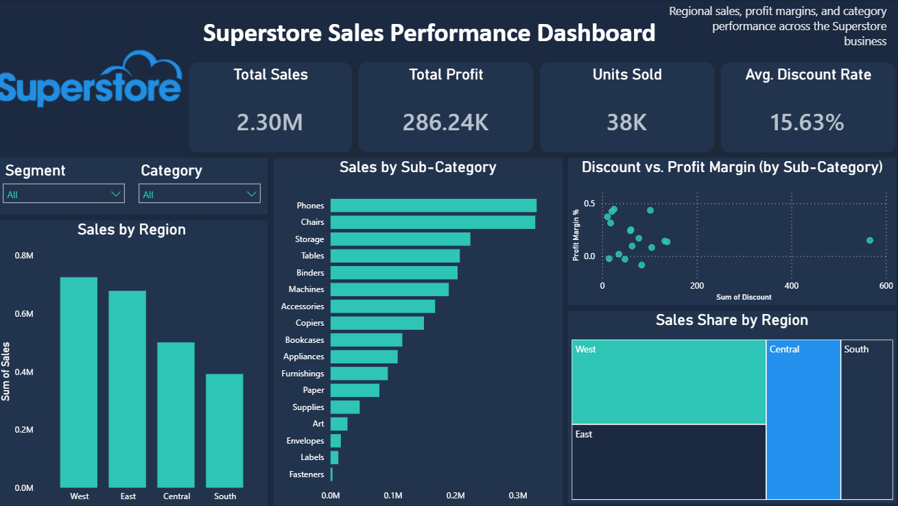

# Superstore Sales Performance Report

**Report type:** Diagnostic and Recommendation
**Source:** Superstore dataset (Kaggle)
**Tool:** Power BI

---

## About this report

This report looks at sales and profit across the Superstore business. It explains where profit is falling behind sales, and what that pattern suggests. It ends with recommendations based on what the data shows.

The dataset has no order date column, so this report does not cover trends over time. It focuses on what the data shows right now, and why.

---

## Data notes

- Rows before cleaning: 9,995
- Duplicate rows removed: 17
- Columns: 13
- Fields used: Ship Mode, Segment, Country, City, State, Postal Code, Region, Category, Sub-Category, Sales, Quantity, Discount, Profit
- No date field is present, so no forecasting or trend analysis is included

---

## Dashboard overview

The dashboard shows total sales, total profit, units sold, and average discount rate at the top. Below that are four charts covering region, sub-category, and the relationship between discount and profit margin.

---

## Key numbers

| Metric                | Value         |
| --------------------- | ------------- |
| Total Sales           | 2.30M         |
| Total Profit          | 286.24K       |
| Units Sold            | 38K           |
| Average Discount Rate | 15.63%        |
| Overall Profit Margin | roughly 12.4% |

[SCREENSHOT: KPI cards]

Sales look strong on the surface. But a profit margin near 12% on a discount rate above 15% is a signal worth checking closer. That gap is the starting point for this report.

---

## Sales by region

[SCREENSHOT: Sales by Region]

West leads with the highest sales, followed by East, then Central, then South. The gap between West and South is close to double. This tells us where volume is coming from, but not where profit is coming from. Sales volume and profit do not always move together, which is why the next section matters more than this one.

---

## Sales by sub-category

[SCREENSHOT: Sales by Sub-Category]

Phones and Chairs bring in the most sales, sitting well above every other sub-category. Storage, Tables, Binders, and Machines form a middle group. Supplies, Art, Envelopes, Labels, and Fasteners sit at the bottom with small sales totals.

High sales alone does not tell us if a sub-category is healthy. Some of the top sellers may still carry weak margins once discount is factored in.

---

## Discount against profit margin

[SCREENSHOT: Discount vs Profit Margin scatter chart]

This chart plots each sub-category by total discount against profit margin. A few patterns stand out.

Sub-categories with low discount, generally under 60, sit at strong margins, ranging from about 20% up to 44%. These are the healthiest part of the business.

A small cluster sits in the mid-discount range, around 100 to 130, with margins closer to 8% to 14%. One sub-category in this range drops to a negative margin, close to -9%. This is the clearest sign of a problem area in the dataset. Heavier discounting lines up with weaker, and in one case negative, margin.

Two sub-categories with low discount still sit near zero or slightly negative margin. This means discount is not the only factor at play. Something else, possibly shipping cost, product cost, or return rate, is affecting these specific sub-categories even without heavy discounting.

One sub-category sits far to the right, close to 550 to 600 in discount, yet still holds a margin near 15%. High discount does not automatically mean a loss. It depends on the sub-category.

---

## What this tells us

Sales performance and profit performance are not the same story in this dataset. A sub-category can rank high in sales and still perform poorly on margin once discount is applied. The clearest case is the sub-category sitting near -9% margin in the mid-discount cluster. This is the strongest candidate for the source of profit drag in the business.

There is also a smaller group of low-discount, low-margin sub-categories. These need separate attention, since discount reduction will not fix them.

---

## Recommendations

**Review discount policy on the mid to high discount cluster.** The sub-categories sitting between 100 and 130 in discount, especially the one showing a negative margin, should be checked first. Reducing discount depth here is the most direct lever available.

**Investigate the low-discount, low-margin outliers separately.** Since these are not explained by discounting, look at cost structure, shipping cost, or return volume for these specific sub-categories before assuming discount is the cause.

**Protect the low-discount, high-margin group.** Sub-categories sitting under 20% discount with margins above 30% are the strongest part of the business. Any future promotional planning should avoid pulling these into deeper discount tiers without testing the effect on margin first.

**Use Region and Category filters to narrow the mid-discount cluster further.** The dashboard slicers allow drilling into Region, Category, and Segment. Before making a policy change, confirm whether the negative margin sub-category is concentrated in one region or spread evenly, since a regional fix is different from a company wide one.

---

## Limitations

This report is based on a snapshot with no date field, so it cannot say whether these patterns are improving or getting worse over time. It also groups sub-categories by total discount and margin without weighting for how many orders sit behind each point, so a sub-category with very few orders can look more extreme on the chart than it actually is in dollar terms. A follow-up pass with order-level detail would sharpen these findings.
